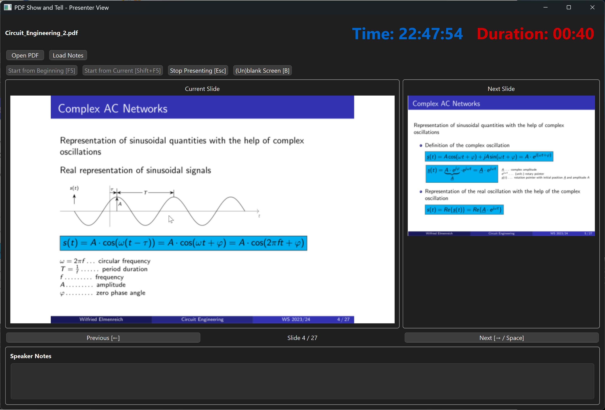
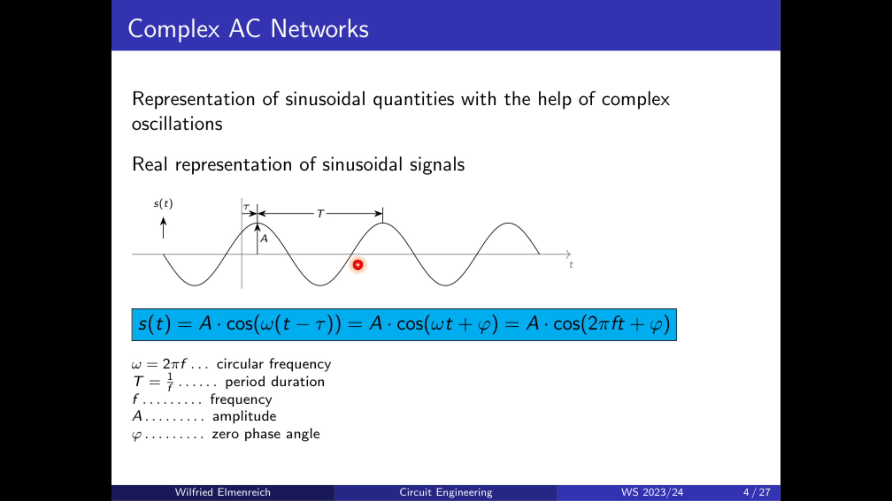

# PDF Show and Tell

A professional dual-screen presentation tool for displaying PDF slides with a dedicated presenter view.

It always annoyed me that I don't have a convenient presentation tool fopr my PDF slides made with LateX Beamer. This tool uses mostly the same key bindings as power point and should be very intuitive to use, especially if you have used powerpoint before. 
My main intention was to improve the quality of my presentations and my teaching of the Circuits Engineeing course at University of Klagenfurt.

The tool is written in Python 3 and runs on Windows, Linux and MacOS.

## Features

### Dual Screen Support
- **Presenter View**: Full-featured control interface on your primary screen
- **Audience View**: Clean, fullscreen presentation on secondary display
- Automatic detection of multiple monitors
- Works with single monitor setup (both views on same screen)

### Presenter Interface
- **Current Slide Preview**: Large preview of the slide being presented
- **Next Slide Preview**: See what's coming next
- **Speaker Notes**: Display notes synchronized with each slide
- **Time Display**: Large, easy-to-read current time (24pt, blue)
- **Presentation Timer**: Track elapsed presentation time (24pt, red)
- **Slide Counter**: Always know where you are in the presentation

### Interactive Laser Pointer
- Move your mouse over the current slide in presenter view
- A bright red laser pointer with sun rays effect appears at the corresponding position on the audience screen
- Perfect for highlighting specific content during your presentation
- Automatically disappears when mouse leaves the slide area

### Presentation Controls
- **Start from Beginning** [F5]: Launch presentation from first slide
- **Start from Current** [Shift+F5]: Begin presenting from current slide position
- **Blank Screen** [B]: Toggle black screen to refocus audience attention
- **Navigation**: Use arrow keys, space bar, or on-screen buttons
- **Stop Presenting** [Esc]: Exit presentation mode

### Smart Features
- **Auto-load Notes**: Automatically loads `filename_notes.txt` when opening `filename.pdf`
- **Session Persistence**: Remembers last opened file and slide position
- **Slide Caching**: Fast slide rendering with intelligent caching
- **Keyboard Shortcuts**: Full keyboard control even when presentation window has focus

## Screenshots

### Presenter View
Below is the presenter view displaying the current slide, the next slide, time, and the duration of the presentation so far.



### Presentation View
Here is the audience view showing the full slide with a laser pointer marker highlighting a specific area.



## Installation

### Requirements
- Python 3.6 or higher
- PyMuPDF (fitz)
- PyQt6
- screeninfo

### Install Dependencies

```bash
pip install PyMuPDF PyQt6 screeninfo
```

## Usage

### Starting the Application

```bash
python pdfsat.py
```

Or make it executable:
```bash
chmod +x pdfsat.py
./pdfsat.py
```

### Opening a Presentation

1. Click **Open PDF** or use the file dialog
2. Navigate to your PDF file
3. The application will automatically look for a matching notes file

### Creating Speaker Notes

Create a text file with the same name as your PDF, appending `_notes.txt`:
- PDF: `my_presentation.pdf`
- Notes: `my_presentation_notes.txt`

#### Notes File Format

```
Notes for first slide.
These will appear when slide 1 is displayed.

---

Notes for second slide.
Multiple lines are supported.

---

--5--
Notes for slide 5.
Use --N-- to specify exact slide numbers (1-indexed).

---

Notes for slide 6.
Continues sequentially after explicit numbering.
```

### Keyboard Shortcuts

| Key | Action |
|-----|--------|
| **F5** | Start presentation from beginning |
| **Shift+F5** | Start from current slide |
| **Esc** | Stop presenting |
| **→** or **Space** | Next slide |
| **←** | Previous slide |
| **B** | Blank/unblank screen |

### Using the Laser Pointer

1. Start your presentation
2. Move your mouse over the current slide preview in the presenter window
3. A red laser pointer will appear at the corresponding position on the audience screen
4. Move the mouse to point at different areas
5. Move mouse away from slide to hide the pointer

## Configuration

Settings are automatically saved to `~/.pdfsat.ini`:
- Last opened file
- Last viewed slide
- Last directory

## Multi-Monitor Setup

### Recommended Configuration
1. **Primary Monitor**: Your laptop screen or main display (presenter view)
2. **Secondary Monitor**: Projector or external display (audience view)

The application automatically:
- Moves the presenter window to the primary screen when starting presentation
- Opens the fullscreen view on the secondary screen
- Keeps focus on the presenter window for keyboard control

### Single Monitor Mode
If no secondary display is detected, the presentation will open fullscreen on the primary screen. The presenter window will be behind it, but you can still use keyboard shortcuts for control.

## Technical Details

- Built with PyQt6 for cross-platform compatibility
- PyMuPDF for fast PDF rendering
- Intelligent slide caching for smooth performance
- Real-time coordinate mapping for laser pointer accuracy
- Session persistence for seamless workflow

## License

Released under the WTFPL (Do What The Fuck You Want To Public License)

## Author

Wilfried Elmenreich, October 2025

## Contributing

Contributions are welcome! Feel free to:
- Report bugs
- Suggest features
- Submit pull requests
- Improve documentation

## Troubleshooting

### Dependencies Not Found
If you see import errors, ensure all dependencies are installed:
```bash
pip install PyMuPDF PyQt6 screeninfo
```

### Presentation Window Not Showing
- Check that your secondary monitor is properly connected
- Verify display settings in your operating system
- Try starting from current slide (Shift+F5) instead of from beginning

### Laser Pointer Not Working
- Ensure you've started the presentation (not just loaded the PDF)
- Move mouse directly over the slide preview area
- The pointer only appears when mouse is within the slide boundaries

### Notes Not Loading
- Verify the notes file has the exact same name as PDF with `_notes.txt` suffix
- Check that the notes file is in the same directory as the PDF
- Ensure the notes file uses UTF-8 encoding